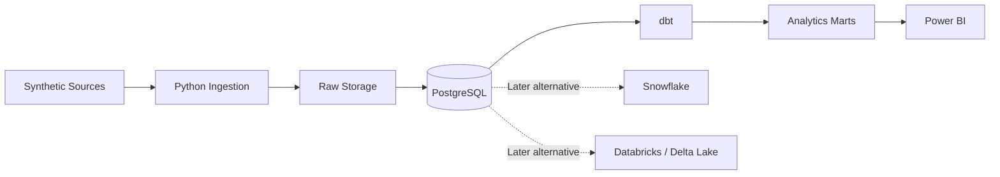

# Service Operations Data Platform

A local-first, portfolio-grade data platform for analysing IT incidents and service requests. It is designed to demonstrate practical Data Engineer and Data Analyst skills relevant to interviews in Germany, without using employer or confidential data.

## Business problem

Service operations teams need reliable answers about ticket volume, backlog, SLA performance, resolution time, recurring categories, team performance, channels, and potential SLA risk. The planned platform will use deterministic synthetic service-management data to make those questions reproducible and safely shareable.

## Planned architecture



Snowflake and Databricks are planned alternative implementations, not mandatory local dependencies.

## Technology roadmap

Python 3.12, PostgreSQL, SQL, Docker Compose, dbt Core, GitHub Actions, Snowflake, PySpark/Delta Lake, Terraform, and Power BI will be introduced only in their planned phases. The local PostgreSQL path remains the runnable baseline.

## Current status

Phases 0–2 are complete and merged. Phase 3 is implemented and under review: it adds recoverable,
audited ELT ingestion with idempotency, watermarking, and quarantine handling. dbt models, cloud
resources, Airflow, and Power BI artifacts are not implemented.

| Phase | Scope | Status |
| --- | --- | --- |
| 0 | Project foundation | Complete |
| 1 | Synthetic data generation and Parquet | Complete |
| 2 | PostgreSQL and SQL | Complete |
| 3 | ETL, ELT, and data quality | Implemented; in review |
| 4 | dbt | Not started |
| 5 | CI/CD | Not started |
| 6 | Snowflake | Not started |
| 7 | Databricks, PySpark, and Delta Lake | Not started |
| 8 | Terraform | Not started |
| 9 | Power BI semantic model | Not started |
| 10 | Power BI report | Not started |
| 11 | Orchestration and observability | Not started |
| 12 | Portfolio and interview package | Not started |

## Prerequisites

- Python 3.12
- Docker Desktop with Docker Compose v2 (for PostgreSQL checks)
- PowerShell 7+ on Windows, or Bash and `make` on macOS/Linux

## Initial setup

Windows PowerShell:

```powershell
./scripts/setup.ps1
```

Bash:

```bash
python3.12 -m venv .venv
. .venv/bin/activate
python -m pip install --upgrade pip
python -m pip install -e ".[dev]"
cp .env.example .env
```

## Development commands

| Task | PowerShell | Bash / Make |
| --- | --- | --- |
| Smoke test | `.\.venv\Scripts\python -c "from service_ops import foundation_status; print(foundation_status())"` | `make smoke` |
| Tests | `.\scripts\check.ps1` | `make test` |
| Ruff | `.\.venv\Scripts\python -m ruff check .` | `make lint` |
| mypy | `.\.venv\Scripts\python -m mypy src` | `make typecheck` |
| All non-Docker checks | `.\scripts\check.ps1` | `make check` |
| Validate Compose | `docker compose --env-file .env.example config` | `make compose-config` |
| Start PostgreSQL | `docker compose --env-file .env.example up -d` | `make up` |
| PostgreSQL health | `docker compose --env-file .env.example exec postgres pg_isready -U service_ops_app -d service_ops` | `make postgres-health` |
| PostgreSQL connection | `docker compose --env-file .env.example exec postgres psql -U service_ops_app -d service_ops -c "SELECT 1"` | `make postgres-connect` |
| Stop PostgreSQL | `docker compose --env-file .env.example down` | `make down` |

`scripts/check.ps1 -WithDocker` runs the PowerShell checks plus the Docker lifecycle. Docker uses `.env` when started directly; copy `.env.example` first and replace its local-only password.

## Phase 1 generation

```bash
# Small reviewable sample (already committed under data/sample/phase-01)
python -m service_ops generate --count 25 --seed 42 --output-directory data/sample/phase-01

# Larger ignored source data
python -m service_ops generate --count 1000 --seed 42 --output-directory data/raw/phase-01

# Explicit invalid examples are written separately as invalid_tickets.json
python -m service_ops generate --count 1000 --seed 42 --inject-defects --defect-rate 0.05

python -m service_ops validate-sample
```

The generator emits teams, agents, customers, categories, subcategories, SLA rules, tickets, ticket status history, and `manifest.json` in JSON, CSV, and Snappy Parquet. See `docs/data_dictionary/phase-01-source-data.md` for relationships and fields.

## Phase 3 pipeline

```bash
python -m service_ops database initialise
python -m service_ops pipeline run-pipeline
python -m service_ops pipeline show-status
```

The pipeline stages valid typed-Parquet tickets, tracks an audit run and source watermark, and
quarantines malformed ticket records without advancing a failed record's watermark. Phase 4 will
provide the canonical dbt transformations after this raw/staging contract.

## Cost strategy

Phase 0 uses only local, open-source tooling. Future cloud and paid services remain optional, are documented separately, and will never be provisioned without explicit approval.

## Known limitations

- dbt transformations, CI workflow, Snowflake, Databricks, Terraform, and dashboard work are not yet implemented.
- Snowflake, Databricks, and Power BI are not yet implemented.
- The Compose service uses a local-development password from `.env`; production secret management is intentionally out of scope for Phase 0.
- This workstation does not have a native Python 3.12 interpreter; Phase 0 Python checks were executed successfully in an isolated Python 3.12 container.

Start with [PROJECT_SETUP.md](PROJECT_SETUP.md), then [PLANS.md](PLANS.md) and [docs/learning/phase-00-foundation.md](docs/learning/phase-00-foundation.md).
