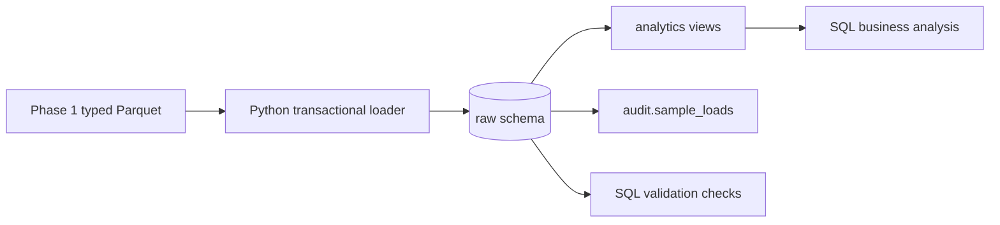

# Phase 2 PostgreSQL architecture

Phase 2 is a local, reproducible relational implementation of the committed Phase 1 source sample.
It deliberately stops before the Phase 3 pipeline and Phase 4 dbt transformation layers.

## Layers and grain

`raw` stores the source-shaped reference entities, one ticket per `ticket_id`, and one status event
per `status_event_id`. `audit.sample_loads` records a sample batch checksum. `analytics` supplies
read-only dimensional and fact views: `fct_tickets` is one row per ticket and
`fct_ticket_status_events` is one row per lifecycle event. `staging` is intentionally created but
unused until the planned ETL/ELT phase.

The loader reads only committed typed Parquet. It validates the manifest checksum and source
relationships before a single transaction inserts rows with `ON CONFLICT DO NOTHING`; rerunning a
batch therefore makes no duplicate rows. A database transaction rolls back all inserts when an
insert or constraint fails.

## Constraints and performance

Primary and foreign keys protect identifiers and relationships. Check constraints restrict priority,
status, positive SLA targets, non-negative measures, valid satisfaction, and lifecycle ordering.
The agent-to-assigned-team rule is independently detected by `phase_02_validation.sql`, because it
spans two rows. Indexes support source joins, common ticket filters, lifecycle access, and batch
audit. Run `EXPLAIN (ANALYZE, BUFFERS)` for the documented plan examples after loading data; the
small sample may legitimately choose a sequential scan.

## Recovery

`python -m service_ops database reset --force` drops only the four Phase 2 schemas. It is guarded
to avoid accidental execution. Recreate the local state with `database initialise` then
`database load-sample`. The committed Parquet files are untouched.
